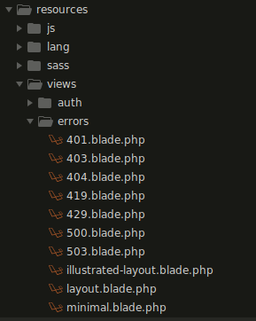

# Index

## Table of Contents

* [The Basics](#The-Basics)
    * [Error Handling](#Error-Handling)

* [Security](#Security)
    * [Authentication](#Authentication)


## The Basics

### Error Handling

Public the Laravel's error templates by running command:

`php artisan vendor:publish --tag=laravel-errors`



## Security

### Authentication

Laravel's `laravel/ui` package provides a quick way to scaffold all of the routes and views you need for authentication using a few simple commands:

```
composer require laravel/ui:^2.4
php artisan ui vue --auth
```
